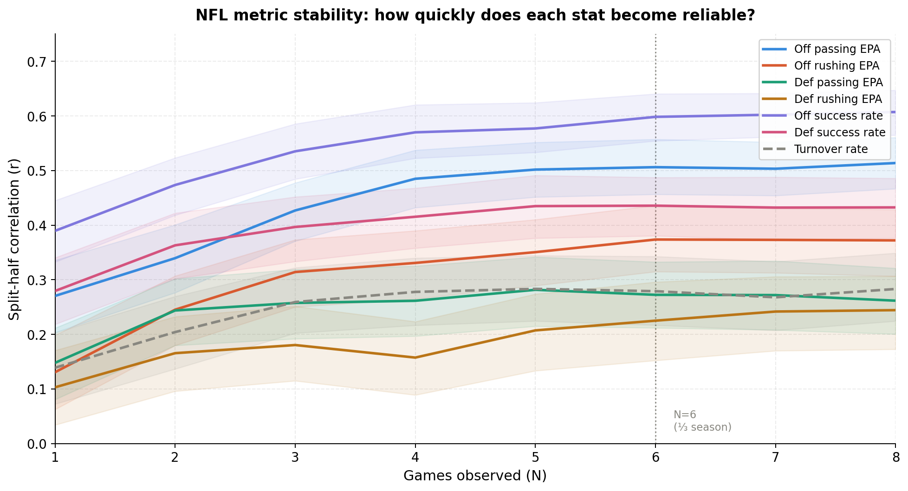
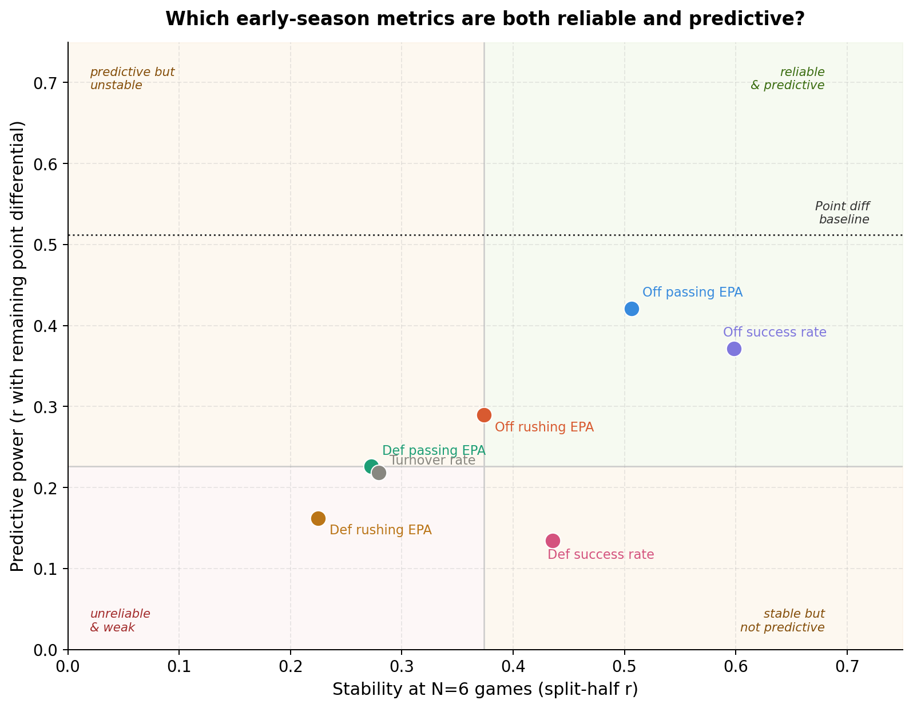
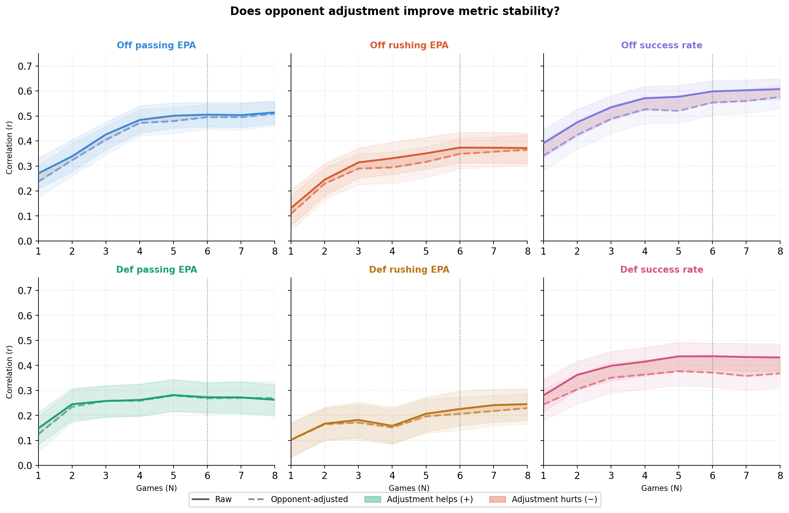

# NFL Metric Stability Analysis

**Author:** Matthew Zhou
**Stack:** Apache Spark (Scala), Python, Hadoop/HDFS
**Data:** nflFastR play-by-play, NFL regular seasons 1999–2024 (2.77 GB, 811,956 cleaned plays)

Analyzes 25 years of NFL play-by-play data to quantify how quickly team performance metrics become trustworthy and whether that reliability translates to actual predictive power.

---

## Findings







- **Offensive success rate** is the most stable metric after just 6 games (r=0.60)
- **Offensive passing EPA** is the strongest predictor of future point differential (r=0.42 at N=6)
- No individual EPA metric outperforms raw early-season point differential as a predictor (baseline r=0.47)
- Within this sample, leave-one-out opponent adjustment had negligible effect, suggesting that opponent-strength variation was not a major driver of the observed stability patterns
- Turnover rate never stabilizes across all 8 game windows, confirming it as a noise variable

---

## Metrics

| Metric | Description | Perspective |
|---|---|---|
| `off_pass_epa` | Offensive passing EPA per play | Offense |
| `off_rush_epa` | Offensive rushing EPA per play | Offense |
| `off_success` | Offensive success rate | Offense |
| `def_pass_epa` | Defensive passing EPA allowed per play | Defense |
| `def_rush_epa` | Defensive rushing EPA allowed per play | Defense |
| `def_success` | Defensive success rate allowed | Defense |
| `turnover_rate` | Turnovers per play | Noise control |

`turnover_rate` is included specifically because it is expected to behave differently from every other metric: low internal consistency (fumble recoveries are close to random) but meaningful correlation with winning because turnovers directly affect game outcomes. That combination makes it a useful built-in contrast case.

**EPA** (Expected Points Added) measures how much a play moved the expected scoring margin relative to average in the same down-and-distance situation. **Success rate** is binary: a play is successful if it gains enough yards to maintain expected scoring position (~40% of needed yards on 1st down, 60% on 2nd, 100% on 3rd/4th).

---

## Methodology

- **Split-half reliability** at N=1–8: split each team-season into an early window (first N games) and late window (games N+1–16), compute Pearson correlation across ~800 team-seasons, bootstrap 1000x for 95% CIs
- **N capped at 8**: beyond N=8 the late window shrinks below 8 games, adding measurement noise — that would be an artifact, not a finding
- **Bye weeks**: handled via `dense_rank()` over week number so game counts are accurate even when week numbers skip
- **16-game cap**: weeks 17+ dropped so all seasons (including post-2021 17-game seasons) are comparable
- **Leave-one-out opponent adjustment**: for each play in game G, opponent quality is estimated from the opponent's other games that season — avoids the circular bias of including game G in its own adjustment
- **Bootstrap on driver**: after aggregating to ~800 team-season rows, bootstrap runs in plain Scala on the Spark driver rather than as distributed jobs — reduces wall time from hours to minutes with identical results

### Validity

The analysis rests on two independent checks. **Internal consistency** (Q1) tests whether a metric agrees with itself across non-overlapping game windows within the same season — bootstrapped 1000x to produce honest confidence intervals rather than a single fragile estimate. **Predictive validity** (Q2) tests whether that consistency reflects something real about team quality by correlating early-window metrics against a strictly non-overlapping late-window outcome. A metric that passes both checks is reliably measuring something that matters. These two checks are independent by design, and the quadrant chart makes both dimensions visible simultaneously.

---

## Repository Structure

```
.
├── src/
│   ├── Clean.scala          ← ETL: filter to REG season, normalize teams, cap at 16 games
│   ├── CountRecs.scala      ← EDA: record counts, null checks, column stats
│   ├── FirstCode.scala      ← EDA: descriptive stats, team-season aggregation
│   ├── Stability.scala      ← Q1: split-half correlation with bootstrap CIs, N=1–8
│   ├── Predictive.scala     ← Q2: early-window metric vs. late-window outcomes + baseline
│   └── OpponentAdjust.scala ← Q3: LOO opponent-adjusted stability vs. raw
├── results/
│   ├── stability_results.csv
│   ├── predictive_results.csv
│   ├── opponent_adjust_results.csv
│   ├── fig1_stability_curves.png
│   ├── fig2_quadrant_chart.png
│   └── fig3_opponent_adjustment.png
├── visualize.py             ← generates all 3 figures from result CSVs
├── requirements.txt
├── ingest.sh                ← HDFS upload script
└── .gitignore
```

---

## Running the Pipeline

### Prerequisites

Raw data is not included in this repository (2.77 GB). Download via the [`nflreadr`](https://nflreadr.nflverse.com/) R package:

```r
library(nflreadr)
pbp <- load_pbp(1999:2024)
write.csv(pbp, "nfl_pbp_1999_2024.csv", row.names = FALSE)
```

Upload to HDFS:
```bash
bash ingest.sh
```

### Spark pipeline

All Scala files run directly in `spark-shell` — no compile step needed.

```bash
spark-shell --deploy-mode client
```

```scala
:load src/Clean.scala
:load src/CountRecs.scala
:load src/FirstCode.scala
:load src/Stability.scala
:load src/Predictive.scala
:load src/OpponentAdjust.scala
```

### Copy results off cluster

```bash
hdfs dfs -getmerge /user/<hdfs_user>/nfl_stability_results        results/stability_results.csv
hdfs dfs -getmerge /user/<hdfs_user>/nfl_predictive_results       results/predictive_results.csv
hdfs dfs -getmerge /user/<hdfs_user>/nfl_opponent_adjust_results  results/opponent_adjust_results.csv
```

### Generate figures

```bash
pip install -r requirements.txt
python visualize.py
```

---

## Limitations

**Era bias:** NFL rules shifted significantly over 1999–2024, systematically increasing passing EPA. Correlations are computed within each team-season, so within-season era effects are small — but cross-era generalization of magnitudes should be treated with caution.

**Franchise relocation:** `Clean.scala` normalizes historical team codes (OAK→LV, SD→LAC, STL→LA) so each franchise has a continuous identity across seasons.

**Home/away imbalance:** Small early windows may not be balanced between home and away games, adding noise to low-N correlations beyond sample size alone.
